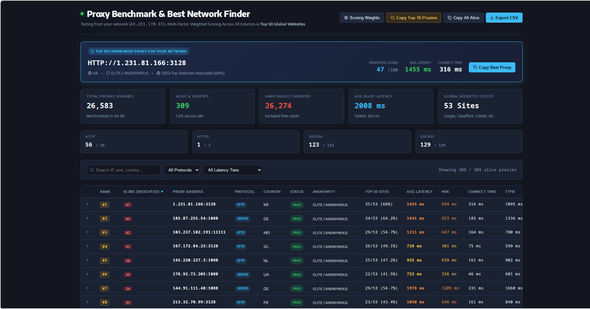
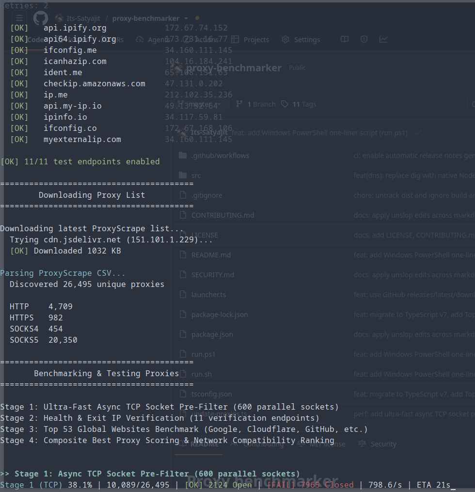
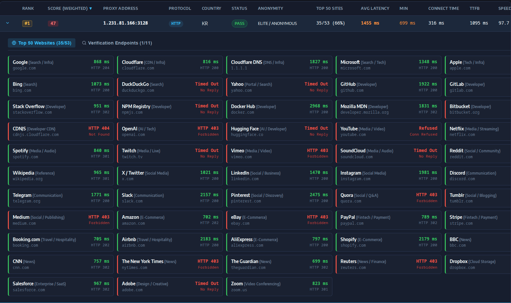

# Proxy benchmarker

Finds working public proxies for your local network by testing connection latency, anonymity, and reachability against 50 top websites. Outputs sorted proxy lists (`http.txt`, `socks5.txt`) and a self-contained HTML report with live ranking controls.



---

## Quick run

### Linux & macOS

```bash
curl -fsSL https://raw.githubusercontent.com/Its-Satyajit/proxy-benchmarker/master/run.sh | bash
```

### Windows (PowerShell)

```powershell
irm https://raw.githubusercontent.com/Its-Satyajit/proxy-benchmarker/master/run.ps1 | iex
```

### Cross-platform (nub / node)

```bash
nub launcher.ts
```

---

## How it works

Testing 26,000+ public proxies with curl alone takes over 45 minutes because most are offline. This tool runs a 3-stage funnel to finish in under 90 seconds:



1. **TCP port probe (600 parallel sockets).** Connects directly to proxy IPs with raw Node sockets (1.2s timeout). Drops dead IPs in roughly 15 seconds without spawning curl processes.
2. **Health and anonymity verification.** Probes surviving endpoints with parallel curl workers to detect exit IPs, TLS handshake time, and anonymity tier.
3. **Website benchmark.** Tests reachability, HTTP status codes, and TTFB across 50 top global websites (Google, Cloudflare, GitHub, OpenAI, etc.).



---

## Ranking formula

Scores run from 0 to 100 points. Reachability gates total score:

$$\text{Usability ratio} = \frac{\text{Websites passed}}{50}$$

$$\text{Final score} = (\text{Usability ratio} \times 50\text{ pts}) + (\text{Performance score} \times \text{Usability ratio})$$

| Metric | Max points | Details |
| :--- | :---: | :--- |
| **50 Top sites** | 50 pts | Percentage of reachable global websites. |
| **Average latency** | 20 pts | Scaled from 0 to 2,500 ms across successful endpoints. |
| **Minimum latency** | 8 pts | Peak response time on fastest endpoint. |
| **Connect time** | 8 pts | TCP handshake duration. |
| **TTFB** | 7 pts | Time to first byte. |
| **Bandwidth** | 7 pts | Download rate scaled up to 500 KB/s. |
| **Anonymity** | 10 pts | 10 pts for masking local public IP, 0 for leaking. |

---

## Local development

### Requirements
* Node.js v18+ or nub (Linux, macOS, Windows)
* curl (standard on Linux, macOS, Windows 10/11)

### Commands

```bash
# Clone
git clone https://github.com/Its-Satyajit/proxy-benchmarker.git
cd proxy-benchmarker

# Install dependencies
nub install

# Type-check
nub run typecheck

# Run benchmark
nub update-proxies.ts

# Build standalone minified bundle
nub run build
```

---

## Environment variables

| Variable | Default | Details |
| :--- | :---: | :--- |
| `TCP_CONCURRENCY` | `600` | Parallel TCP socket checks in stage 1. |
| `TCP_TIMEOUT` | `1200` | Socket timeout in milliseconds. |
| `CONCURRENCY` | `150` | Parallel curl workers for stages 2 and 3. |
| `CONNECT_TIMEOUT` | `3` | Connection timeout in seconds. |
| `TIMEOUT` | `4` | Total request timeout in seconds. |
| `WEBSITE_TIMEOUT` | `3.5` | Website check timeout in seconds. |
| `DNS` | `1.1.1.1` | Resolver for endpoint IPs. |
| `LIMIT` | `0` | Number of proxies to test (0 = all). |
| `FULL_BENCHMARK` | `false` | Tests all 11 verification endpoints when true. |
| `BENCHMARK_WEBSITES` | `true` | Enables 50-site reachability test. |

### Example runs

```bash
# Quick test on first 50 proxies
LIMIT=50 nub update-proxies.ts

# Fast scan on unstable network
TIMEOUT=5 CONNECT_TIMEOUT=3 nub update-proxies.ts
```

---

## Project layout

```
├── update-proxies.ts        # Main benchmark orchestrator
├── launcher.ts              # Fetches release and opens browser
├── run.sh                   # Shell runner
├── tsconfig.json            # TypeScript v7 config
├── package.json             # Scripts and metadata
├── src/
│   ├── types.ts             # Type definitions
│   ├── config.ts            # Options and defaults
│   ├── websites.ts          # 50 target websites list
│   ├── dns.ts               # DNS resolution and public IP check
│   ├── csv.ts               # Proxifly free-proxy-list downloader and CSV parser
│   ├── proxy.ts             # Normalization and curl arguments
│   ├── tester.ts            # 3-stage funnel engine
│   ├── reporter.ts          # HTML report builder and file exporter
│   └── terminal.ts          # ANSI terminal output
├── dist/
│   └── proxy-benchmarker.min.mjs # Standalone bundle
├── .github/workflows/
│   └── release.yml          # Automated release workflow
├── benchmark-report.html    # Interactive HTML report
├── benchmark-report.json    # Full JSON telemetry
└── http.txt, https.txt, socks4.txt, socks5.txt # Filtered proxy lists
```

---

## Automated releases

Pushes to `master` trigger `.github/workflows/release.yml`, which runs `tsc --noEmit`, bundles `dist/proxy-benchmarker.min.mjs` via esbuild, and publishes a tagged release with auto-generated notes.

---

## Upstream projects and data sources

* [proxifly/free-proxy-list](https://github.com/proxifly/free-proxy-list) for raw proxy list data.
* [cURL](https://curl.se) for network probing.
* [Iconify](https://iconify.design) for SVG vector icons.
* [Nub](https://nubjs.com) for Node toolchain execution.
* [esbuild](https://esbuild.github.io) for bundling.
* Verification endpoints: Cloudflare, Google DNS, icanhazip.com, ifconfig.co, ipify.org, ip-api.com, seeip.org, myip.la.

---

## Contributing

See [CONTRIBUTING.md](file:///home/satyajit/Desktop/proxies/CONTRIBUTING.md) for setup and code standards.

---

## Security

See [SECURITY.md](file:///home/satyajit/Desktop/proxies/SECURITY.md) for vulnerability reports and public proxy safety notes.

---

## License

MIT. See [LICENSE](file:///home/satyajit/Desktop/proxies/LICENSE).
