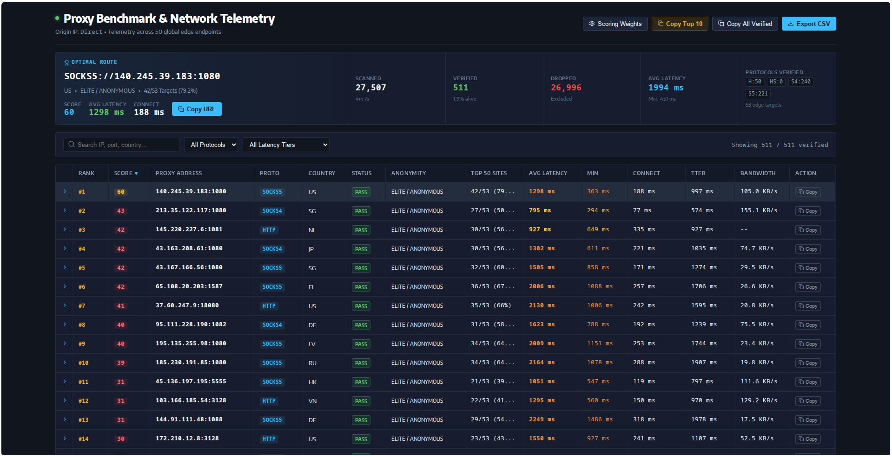
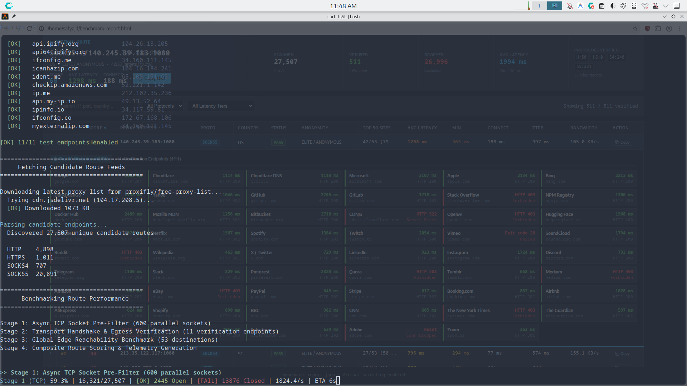
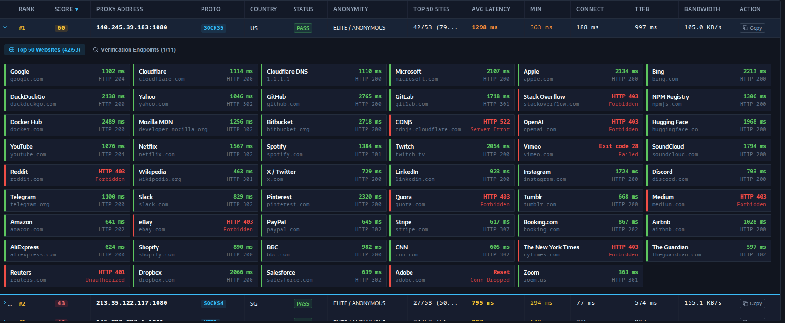

# Proxy benchmarker

Asynchronous network telemetry and proxy benchmarking suite. Measures TCP handshake latency, TLS negotiation, Time to First Byte (TTFB), transfer throughput, and reachability across 50 global edge endpoints.

A 3-stage non-blocking pipeline evaluates 50,000+ candidate routes aggregated and deduplicated across 10 open-source upstream feeds in under 90 seconds, outputting normalized proxy configurations (`http.txt`, `socks5.txt`), machine-readable JSON telemetry (`benchmark-report.json`), and an interactive client-side report.



---

## Quick run

### Linux & macOS

```bash
# Benchmark full candidate proxy list (fast jsDelivr CDN)
curl -fsSL https://cdn.jsdelivr.net/gh/Its-Satyajit/proxy-benchmarker@master/run.sh | bash

# Benchmark a single specific proxy route
curl -fsSL https://cdn.jsdelivr.net/gh/Its-Satyajit/proxy-benchmarker@master/run.sh | bash -s -- socks5://64.227.186.105:1080

# GitHub Raw fallback
curl -fsSL https://raw.githubusercontent.com/Its-Satyajit/proxy-benchmarker/master/run.sh | bash -s -- socks5://64.227.186.105:1080
```

### Windows (PowerShell)

```powershell
# Benchmark full candidate proxy list (fast jsDelivr CDN)
irm https://cdn.jsdelivr.net/gh/Its-Satyajit/proxy-benchmarker@master/run.ps1 | iex

# Benchmark a single specific proxy route
& ([scriptblock]::Create((irm https://cdn.jsdelivr.net/gh/Its-Satyajit/proxy-benchmarker@master/run.ps1))) socks5://64.227.186.105:1080

# GitHub Raw fallback
& ([scriptblock]::Create((irm https://raw.githubusercontent.com/Its-Satyajit/proxy-benchmarker/master/run.ps1))) socks5://64.227.186.105:1080
```

### Cross-platform (nub / node)

```bash
# Full candidate run
nub launcher.ts

# Benchmark a specific proxy or list
nub update-proxies.ts socks5://64.227.186.105:1080
```

---

## Pipeline architecture

Probing tens of thousands of network endpoints with individual subprocesses creates massive CPU and process spawn bottlenecks when 85%+ of candidates are unreachable. This suite uses a tiered funnel to maximize throughput:



1. **Asynchronous TCP socket pre-filter (600 parallel sockets).** Connects directly to candidate IP:port pairs using non-blocking Node.js sockets (1.2s timeout). Eliminates closed ports and unroutable hosts in ~15 seconds without spawning curl processes.
2. **Protocol handshake and egress verification (150 parallel workers).** Probes surviving endpoints to measure TCP connect duration, TLS negotiation time, TTFB, and exit IP leak detection against the local network origin.
3. **Global edge transit benchmark.** Evaluates real-world HTTP/HTTPS reachability, status code return distributions, and latency across 50 major web properties and content delivery networks.



---

## Scoring model

Composite route quality scores range from 0 to 100 points, gated by edge reachability:

$$\text{Usability ratio} = \frac{\text{Websites passed}}{50}$$

$$\text{Final score} = (\text{Usability ratio} \times 50\text{ pts}) + (\text{Performance score} \times \text{Usability ratio})$$

| Telemetry dimension | Max weight | Metric details |
| :--- | :---: | :--- |
| **Edge reachability** | 50 pts | Proportion of 50 global destinations successfully reached. |
| **Average latency** | 20 pts | Round-trip response time (scaled 0 to 2,500 ms). |
| **Minimum latency** | 8 pts | Peak single-request responsiveness. |
| **TCP connect time** | 8 pts | Transport-layer handshake duration. |
| **TTFB** | 7 pts | Time to first byte from target server. |
| **Throughput bandwidth** | 7 pts | Transfer rate (scaled to 500 KB/s). |
| **Egress anonymity** | 10 pts | 10 pts for full masking of origin public IP; 0 for direct leak. |

---

## Local development

### Requirements
* Node.js v18+ or nub (Linux, macOS, Windows)
* curl (standard on Linux, macOS, Windows 10/11)

### Commands

```bash
# Clone
git clone https://github.com/Its-Satyajit/proxy-benchmarker.git
cd proxy-benchmarker

# Install dependencies
nub install

# Type-check
nub run typecheck

# Run benchmark
nub update-proxies.ts

# Build standalone minified bundle
nub run build
```

---

## Concurrency Presets & Options

| Preset | Target Environment | TCP Sockets | Worker Pool | Website Concurrency |
| :--- | :--- | :---: | :---: | :---: |
| `--home` *(Default)* | Standard Home WiFi / Fiber | `80` | `25` | `5` |
| `--safe` | Budget / TP-Link / Low-Resource WiFi | `35` | `12` | `3` |
| `--turbo` / `--vps` | VPS / Server / 10G Datacenter | `600` | `150` | `15` |

### Command line options

```bash
# Safe mode for sensitive home / TP-Link routers
curl -fsSL https://.../run.sh | bash -s -- --safe

# Test first 50 proxies safely
curl -fsSL https://.../run.sh | bash -s -- --safe -n 50

# High-speed Gigabit VPS benchmark
curl -fsSL https://.../run.sh | bash -s -- --turbo
```

---

## Environment variables

| Variable | Default | Details |
| :--- | :---: | :--- |
| `PRESET` | `home` | Concurrency preset (`home`, `safe`, `turbo`). |
| `TCP_CONCURRENCY` | `80` (or `35` in safe) | Parallel TCP socket checks in stage 1. |
| `TCP_TIMEOUT` | `1200` | Socket timeout in milliseconds. |
| `CONCURRENCY` | `25` (or `12` in safe) | Parallel curl workers for stages 2 and 3. |
| `CONNECT_TIMEOUT` | `3.0` | Connection timeout in seconds. |
| `TIMEOUT` | `4.0` | Total request timeout in seconds. |
| `WEBSITE_TIMEOUT` | `4.5` | Website check timeout in seconds. |
| `WEBSITE_CONNECT_TIMEOUT` | `3.0` | Website connection timeout in seconds. |
| `WEBSITE_CONCURRENCY` | `5` (or `3` in safe) | Parallel website checks per candidate. |
| `DNS` | `1.1.1.1` | Resolver for pre-resolving endpoint IPs. |
| `LIMIT` | `0` | Number of proxies to test (0 = all). |
| `FULL_BENCHMARK` | `false` | Tests all 11 verification endpoints when true. |
| `BENCHMARK_WEBSITES` | `true` | Enables 50-site reachability test. |

### Example runs

```bash
# Ultra-gentle run for home routers
PRESET=safe LIMIT=50 nub update-proxies.ts

# Custom fine-tuned concurrency
TCP_CONCURRENCY=40 CONCURRENCY=15 nub update-proxies.ts
```

---

## Telemetry and metrics

Every run writes granular JSON telemetry to `benchmark-report.json`:

```json
{
  "proxy": { "protocol": "socks5", "ip": "185.87.255.54", "port": 1080, "country": "DE" },
  "status": "PASS",
  "compositeScore": 84,
  "anonymity": "ELITE / ANONYMOUS",
  "exitIp": "185.87.255.54",
  "avgLatencyMs": 420,
  "minLatencyMs": 185,
  "avgConnectTimeMs": 95,
  "avgTtfbMs": 280,
  "avgSpeedBps": 184500,
  "websitesPassed": 48,
  "websitesTotal": 50,
  "websiteDetails": [
    { "name": "Google", "domain": "google.com", "ok": true, "httpCode": 204, "totalLatencyMs": 312 }
  ]
}
```

---

## Project layout

```
├── update-proxies.ts        # Main benchmark orchestrator
├── launcher.ts              # Fetches release and opens browser
├── run.sh                   # Shell runner
├── tsconfig.json            # TypeScript v7 config
├── package.json             # Scripts and metadata
├── src/
│   ├── types.ts             # Type definitions
│   ├── config.ts            # Options and defaults
│   ├── websites.ts          # 50 target websites list
│   ├── dns.ts               # DNS resolution and public IP check
│   ├── csv.ts               # Multi-feed downloader, format parser, and Set deduplicator
│   ├── proxy.ts             # Normalization and curl arguments
│   ├── tester.ts            # 3-stage funnel engine
│   ├── reporter.ts          # HTML report builder and file exporter
│   └── terminal.ts          # ANSI terminal output
├── dist/
│   └── proxy-benchmarker.min.mjs # Standalone bundle
├── .github/workflows/
│   └── release.yml          # Automated release workflow
├── benchmark-report.html    # Interactive HTML report
├── benchmark-report.json    # Full JSON telemetry
└── http.txt, https.txt, socks4.txt, socks5.txt # Filtered proxy lists
```

---

## Automated releases

Pushes to `master` trigger `.github/workflows/release.yml`, which runs `tsc --noEmit`, bundles `dist/proxy-benchmarker.min.mjs` via esbuild, and publishes a tagged release with auto-generated notes.

---

## Upstream proxy feeds & credits

Candidate route discovery aggregates and deduplicates data across 10 open-source proxy repositories:

* [proxifly/free-proxy-list](https://github.com/proxifly/free-proxy-list) - Live CSV proxy dataset with protocol and country metadata.
* [ProxyScrape/free-proxy-list](https://github.com/ProxyScrape/free-proxy-list) - Frequently updated HTTP, HTTPS, SOCKS4, and SOCKS5 feeds.
* [hproxy-com/free-proxy-list](https://github.com/hproxy-com/free-proxy-list) - Multi-protocol verified candidate CSVs.
* [proxmint/free-proxy-list](https://github.com/proxmint/free-proxy-list) - Unified protocol URI endpoint lists.
* [proxio-io/proxy-list](https://github.com/proxio-io/proxy-list) - High-volume global candidate endpoint lists.
* [iplocate/free-proxy-list](https://github.com/iplocate/free-proxy-list) - Worldwide proxy route feeds.
* [databay-labs/free-proxy-list](https://github.com/databay-labs/free-proxy-list) - Dedicated HTTP, SOCKS4, and SOCKS5 channel feeds.
* [monosans/proxy-list](https://github.com/monosans/proxy-list) - Continuously scraped and verified proxy lists.

### Infrastructure & tooling credits

* [jsDelivr](https://www.jsdelivr.com) for high-performance global edge CDN delivery and GitHub proxying.
* [cURL](https://curl.se) for fast, low-overhead transport probing.
* [Iconify](https://iconify.design) for SVG vector icons in the interactive report.
* [Nub](https://nubjs.com) for Node toolchain orchestration.
* [esbuild](https://esbuild.github.io) for bundling.
* Network verification endpoints: Cloudflare, Google DNS, `api.ipify.org`, `icanhazip.com`, `ifconfig.me`, `ifconfig.co`, `ident.me`, `checkip.amazonaws.com`, `ip.me`, `api.my-ip.io`, `ipinfo.io`, `myexternalip.com`.

---

## Contributing

See [CONTRIBUTING.md](file:///home/satyajit/Desktop/proxies/CONTRIBUTING.md) for setup and code standards.

---

## Security

See [SECURITY.md](file:///home/satyajit/Desktop/proxies/SECURITY.md) for vulnerability reports and public proxy safety notes.

---

## License

MIT. See [LICENSE](file:///home/satyajit/Desktop/proxies/LICENSE).
